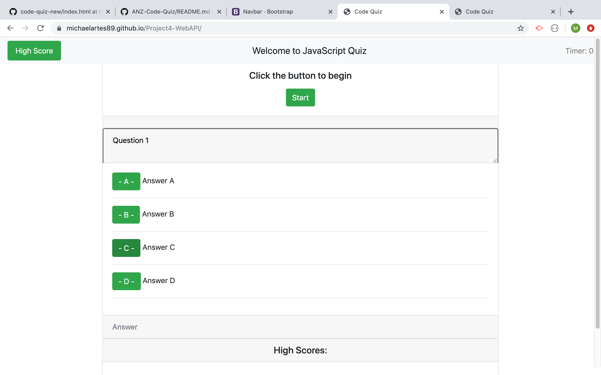

# Project4-JS-InteractiveQuiz
Homework Project 4 for the the JHU Bootcamp - The assignment is a web application that allows the user to take to answer question as part of an interactive quiz. 

# Developer Story 
This assigment presented a very big challenge for students like myself who entered the program with little to no prior experience in coding. Nonetheless, the assigment is very helpful in understanding the fundamentals of professional web development. In order to overcome challege in a professional enviroment, it is important to use a consistent, methodical aproach to your work. It is also important to stay focused on positives and not let yourself become overwhelmed by technical complexity. Having the ability to reach out to someone with more experience for help is crucial to anyone seeking to become a skilled developer. One thing that I find very encouraging is that in only a few weeks, our class is begining to emerge as a database of knowledge. On previous assignemnt I utilized general information posted on youtube, stackoverflow, and github for examples of working code to study. On this project for the first time I was able to go to the github profiles of people in our class to find functional examples of the javascript needed to create this project. I relied on the help of my study group a lot for this project. The help I got from Keisha was especially benefical. She was able to interact with several other class memeber and compare each of their github repositories for examples ways to complete the project. After reviewing a few examples with her after class on Tuesday, I decided I like the fucntion of Alex's project the most and I set my goal to recreate what he had achieved. 

# Overall Progress 
At this point personally I am still very much a novice developer, so for me just logging hours with my hands on the keyboard is important progress. Having exposure to these kinds of projects is really great experience, its invaluable to knowing the full scope and detail of modern applicatons and what it takes to work as a professional in the field. 

    
## Screenshot

 

 ## Link 

 <a href="https://michaelartes89.github.io/Project4-WebAPI/"> Clink Here for Link to Page </a>